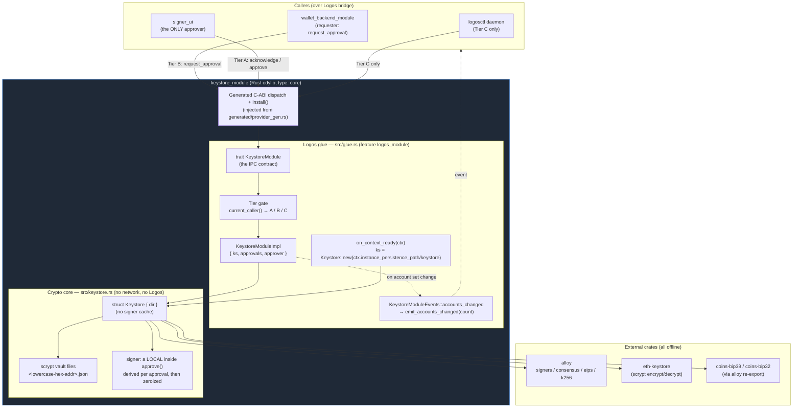
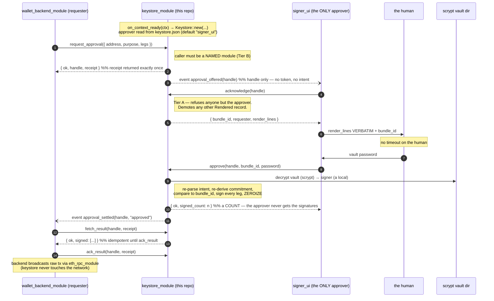

# `logos-evm-keystore-module` — Reference Specification

## Purpose

`logos-evm-keystore-module` is the **keystore** for the Logos multi-chain EVM
wallet. It is a Rust **cdylib Logos module** (`type: core`, `interface: cdylib`)
that owns everything to do with private keys: generating and importing them,
encrypting them at rest as scrypt vaults, and producing **secp256k1 signatures**
**only when a human has approved them** — both EIP-191
`personal_sign` messages and signed EIP-1559 / legacy (EIP-155) transactions.

Its defining property is **isolation**: the module does **no networking**, and a
raw private key never crosses the module's IPC boundary. The only values that
leave the module are **addresses**, **signed payloads** (signature hex / raw
signed-transaction hex), and **(re-)encrypted keystore JSON**. The crypto core is
built on well-established crates — [`alloy`](https://github.com/alloy-rs/alloy)
(signing + transaction encoding), [`eth-keystore`](https://crates.io/crates/eth-keystore)
(Web3 Secure Storage scrypt vaults), and `coins-bip39` / `coins-bip32` (BIP-39 /
BIP-32 HD derivation, consumed through alloy's re-export).

### Where it sits in the EVM wallet system

The EVM wallet is built from seven repositories that talk to each other as
process-isolated Logos modules over a typed RPC bridge:

| Repo | Role | Talks to |
|------|------|----------|
| `logos-evm-net-proxy` | Fail-closed HTTP/RPC client **library crate** (not a module) | — |
| **`logos-evm-keystore-module`** | **Key management + signing (this repo)** | **nothing — leaf module** |
| `logos-evm-eth-rpc-module` | Multi-chain JSON-RPC transport (`concurrency: multi`) | net-proxy |
| `logos-evm-token-list-module` | Token-list fetch/merge per chain | net-proxy |
| `logos-evm-uniswap-module` | Uniswap V2/V3/V4 price oracle + swap building (`concurrency: multi`) | eth-rpc |
| `logos-evm-wallet-backend-module` | Coordinator + tx builder (alloy) | keystore, eth-rpc, token-list, uniswap |
| `logos-evm-wallet-ui` | Universal C++ `ui_qml` app | wallet-backend |

This module is a **leaf**: it declares **no dependencies** (`"dependencies": []`)
and calls no other module. It is driven *by* the `logos-evm-wallet-backend-module`
coordinator (which *requests* an approval as the signing leg of its
send pipeline, and never handles a vault password) or directly by the headless `logosctl`
runtime. Keeping the keystore a dependency-free leaf is deliberate: the component
that holds private keys has the smallest possible attack surface and pulls in no
network-capable code.

---

## Overall architecture

The module is two layers that are deliberately decoupled by a Cargo feature:

* **The crypto core** (`rust-lib/src/keystore.rs`) — pure, offline, Logos-free
  Rust. The `Keystore` struct manages a directory of scrypt vault files. It holds **no**
  decrypted keys: a signer is derived per approval and zeroized before the call
  returns. Unit-tested on its own with
  `cargo test --no-default-features`.
* **The Logos glue** (`rust-lib/src/glue.rs`) — the `KeystoreModule` contract
  trait and its implementation, compiled only behind the default `logos_module`
  feature. It marshals every structured value across the IPC boundary as a JSON
  string, wires the on-context-ready hook to a persistence path, and emits the
  `accounts_changed` event.



**Key isolation, restated against the diagram:** raw private-key bytes exist only
inside `Core` — encrypted in the vault files, and decrypted **only into a local
variable inside `approve()`**, which zeroizes it before returning. There is no
map, no cache and no TTL, so there is no window during which some *other* caller
could reach a live signer. Keys are never returned through `TRAIT`. Only
`Address` strings, signature/transaction hex, and re-encrypted keystore JSON
travel back across the `DISP` boundary — and a signature only ever leaves as the
result of a `Rendered` request a human approved.

---

## Communication with dependencies

This module is a **leaf** — it makes **no outbound calls** to any other module
and opens no sockets. The interesting flow is therefore how a **caller drives it**.
The canonical flow has **three** parties, not two: a **requester** that may ask
but never approve, the **approver** (`signer_ui`) that renders and takes the vault
password, and the human. `logosctl` can reach Tier C only.



The signed values the backend collects are what it hands to `eth_rpc_module` for
`eth_sendRawTransaction`. The keystore itself never performs that broadcast — it
has no network code at all. Note the password crosses **only** the `signer_ui` →
`keystore` edge: the requester never sees it, never sees `render_lines`, and
cannot produce a signature.

---

## Full API reference

The contract is the `KeystoreModule` trait in `rust-lib/src/glue.rs`. The builder
derives the module's `.lidl` interface from this trait (`codegen.rust =
{ crate: "rust-lib", trait: "KeystoreModule", source: "src/glue.rs" }`); every
**non-defaulted** trait method becomes a callable module method. `on_context_ready`
is *defaulted*, so it is a framework hook and **not** part of the IPC contract.

### Conventions

* **Structured returns are JSON strings.** Methods that return `String` return a
  JSON object that is either `{ "ok": true, … }` on success or
  `{ "ok": false, "error": "<message>" }` on failure. The `err()` helper produces
  the error shape; the message text comes from `KeystoreError` (`Display`).
* **Boolean methods** (`has_address`, `delete_account`, `ack_result`,
  `cancel_approval`, `reject`) return a bare `bool` and are **fail-soft**: any internal
  error (bad address, wrong password, keystore not yet initialized) maps to
  `false` rather than an error object.
* **Addresses** are accepted with or without a `0x` prefix, in any case; no EIP-55
  checksum is required (`parse_address` decodes the 20 raw bytes directly). The
  `logosctl` CLI auto-types a `0x…` argument as a number, so in CLI examples
  addresses are passed as **bare hex**.
* **Numeric transaction fields** cross as hex (`0x…`) **or** decimal strings to
  avoid precision loss over JSON; empty/missing numeric fields default to `0`.
* **`logosctl call` argument typing:** `true`/`false` → bool, integers → int,
  else string; `@file` loads file contents as the argument.

### Method index

| Method | Params | Returns | Mutates accounts? |
|--------|--------|---------|-------------------|
| `create_mnemonic` | `words: i64` | `{ ok, phrase }` | no |
| `import_mnemonic` | `params_json: String` | `{ ok, address }` | yes → event |
| `new_account` | `password: String` | `{ ok, address }` | yes → event |
| `import_private_key` | `priv_hex: String, password: String` | `{ ok, address }` | yes → event |
| `import_keystore_json` | `key_json, password, new_password: String` | `{ ok, address }` | yes → event |
| `export_keystore_json` | `address, password: String` | `{ ok, keystore }` | no |
| `list_accounts` | — | `{ ok, accounts: [..] }` | no |
| `has_address` | `address: String` | `bool` | no |
| `delete_account` | `address, password: String` | `bool` | yes → event |
| `request_approval` | `intent_json: String` | `{ ok, handle, receipt, state }` | no |
| `approval_status` | `handle, receipt: String` | `{ ok, state, reason? }` | no |
| `fetch_result` | `handle, receipt: String` | `{ ok, signed: [..] }` | no |
| `ack_result` | `handle, receipt: String` | `bool` | no |
| `cancel_approval` | `handle, receipt: String` | `bool` | no |
| `pending` | — | `{ ok, pending: [..] }` | no |
| `acknowledge` | `handle: String` | `{ ok, bundle_id, requester, render_lines }` | no |
| `approve` | `handle, bundle_id, password: String` | `{ ok, signed_count: n }` | no |
| `reject` | `handle: String` | `bool` | no |
| `caller_identity` | — | `{ ok, kind, identity, approver }` | no |

---

### `create_mnemonic(words: i64) -> String`

Generate a fresh BIP-39 English mnemonic. **Does not persist anything** — the
caller decides whether to import the phrase. The phrase is produced from
`rand::thread_rng()` and returned in cleartext (it is *not* a private key per se,
but it is seed material — treat it as a secret).

* **`words`** — word count. Must be one of `12 | 15 | 18 | 21 | 24`; any other
  value returns an error.

**Success:** `{ "ok": true, "phrase": "word1 word2 … wordN" }`
**Error:** `{ "ok": false, "error": "word count must be 12/15/18/21/24, got 13" }`

```bash
logosctl call keystore_module create_mnemonic 12
# → {"ok":true,"phrase":"… twelve words …"}
```

---

### `import_mnemonic(params_json: String) -> String`

Derive a single account from a mnemonic along the BIP-44 Ethereum path
`m/44'/60'/0'/0/<accountIndex>` and persist its scrypt vault. The argument is a
**JSON object** (`ImportMnemonicParams`):

| Field | Type | Required | Meaning |
|-------|------|----------|---------|
| `phrase` | string | yes | The BIP-39 mnemonic |
| `passphrase` | string | no (default `""`) | Optional BIP-39 passphrase (the "25th word"); applied only if non-empty |
| `accountIndex` (alias `account_index`) | u32 | no (default `0`) | HD index to derive |
| `password` | string | yes | Vault password used to scrypt-encrypt the derived key on disk |

Both `accountIndex` and `account_index` are accepted (serde alias). On success
emits `accounts_changed`.

**Success:** `{ "ok": true, "address": "0x…" }`
**Error:** `{ "ok": false, "error": "<parse / derivation error>" }`

```bash
logosctl call keystore_module import_mnemonic \
  @mnemonic.json   # {"phrase":"test test … junk","accountIndex":0,"password":"pw"}
# → {"ok":true,"address":"0xf39Fd6e51aad88F6F4ce6aB8827279cffFb92266"}
```

---

### `new_account(password: String) -> String`

Create a brand-new random account (`PrivateKeySigner::random()`) and persist its
scrypt vault under `password`. Emits `accounts_changed`.

* **`password`** — vault password.

**Success:** `{ "ok": true, "address": "0x…" }`
**Error:** `{ "ok": false, "error": "vault error: …" }` (e.g. I/O failure)

```bash
logosctl call keystore_module new_account hunter2
```

---

### `import_private_key(priv_hex: String, password: String) -> String`

Import a raw secp256k1 private key and persist its scrypt vault. The key is
consumed and immediately re-encrypted — it is not retained in cleartext beyond the
call, and it is never returned. Emits `accounts_changed`.

* **`priv_hex`** — 32-byte private key in hex, with or without a `0x` prefix.
* **`password`** — vault password.

**Success:** `{ "ok": true, "address": "0x…" }`
**Error:** `{ "ok": false, "error": "invalid private key: …" }`

```bash
logosctl call keystore_module import_private_key \
  ac0974bec39a17e36ba4a6b4d238ff944bacb478cbed5efcae784d7bf4f2ff80 pw
# → {"ok":true,"address":"0xf39Fd6e51aad88F6F4ce6aB8827279cffFb92266"}
```

---

### `import_keystore_json(key_json: String, password: String, new_password: String) -> String`

Import an existing scrypt **keystore JSON** (Web3 Secure Storage format),
decrypting it with `password` and **re-encrypting** it under `new_password` into a
fresh local vault. The decrypted key never leaves the module. Emits
`accounts_changed`.

* **`key_json`** — the source keystore JSON (a string; written to a short-lived
  temp file because `eth-keystore` is path-based, then decrypted).
* **`password`** — password that decrypts the *incoming* keystore JSON.
* **`new_password`** — password used to re-encrypt the vault stored locally.

**Success:** `{ "ok": true, "address": "0x…" }`
**Error:** `{ "ok": false, "error": "vault error: …" }` (wrong `password`, malformed JSON, etc.)

---

### `export_keystore_json(address: String, password: String) -> String`

Export an account as scrypt keystore JSON **without touching the on-disk vault**.
The password is **verified** (the vault is decrypted to prove the password is
correct) and then the canonical on-disk JSON contents are returned. The exported
JSON is itself scrypt-encrypted — it is *not* a cleartext key.

* **`address`** — account to export (with/without `0x`, any case).
* **`password`** — the vault password (must decrypt, else error).

**Success:** `{ "ok": true, "keystore": "<keystore JSON string>" }`
**Error:** `{ "ok": false, "error": "vault error: …" }` (wrong password or missing vault)

---

### `list_accounts() -> String`

List the addresses of all persisted vaults. Vaults are discovered by reading the
keystore directory and parsing each `<addr>.json` filename back into an address;
the list is sorted.

**Success:** `{ "ok": true, "accounts": ["0x…", "0x…"] }` (empty array if none)
**Error:** `{ "ok": false, "error": "keystore not initialized (context not ready)" }`

```bash
logosctl call keystore_module list_accounts
# → {"ok":true,"accounts":["0xf39Fd6e51aad88F6F4ce6aB8827279cffFb92266"]}
```

---

### `has_address(address: String) -> bool`

Return `true` iff a vault file exists for `address`. Fail-soft: an invalid address
or uninitialized keystore returns `false`.

* **`address`** — address to check.

```bash
logosctl call keystore_module has_address f39fd6e51aad88f6f4ce6ab8827279cfffb92266
# → true
```

---

### `delete_account(address: String, password: String) -> bool`

Permanently delete an account's vault. **Password-gated**: the vault is decrypted
with `password` first; only on success is the file removed. Emits `accounts_changed`. Returns `true` only when a vault existed, the
password was correct, and the file was removed; `false` otherwise (missing vault,
wrong password, parse error).

* **`address`** — account to delete.
* **`password`** — its vault password (required to authorize deletion).

```bash
logosctl call keystore_module delete_account <address> pw
# → true
```

---

## Human-approved signing

There is **no way to make this module sign anything except by a human approving
it.** The methods that used to sign on demand — `unlock`, `timed_unlock`, `lock`,
`is_unlocked`, `sign_transaction`, `sign_message`, `sign_digest` — are **deleted
from the contract**, not merely gated. There is no unlocked-signer cache: the
signing key is derived from the vault password *inside* `approve()`, used, and
zeroized before the call returns.

### The three tiers

Every request is classified by the **caller identity** the platform reports
(`logos_rust_sdk::current_caller()`).

| Tier | Methods | Admits |
|------|---------|--------|
| **A** | `pending`, `acknowledge`, `approve`, `reject` | the configured **approver only** (default `signer_ui`) |
| **B** | `request_approval`, `approval_status`, `fetch_result`, `ack_result`, `cancel_approval` | any **named module**; `fetch`/`ack`/`cancel`/`status` additionally require the **receipt** |
| **C** | account management (`create_mnemonic` … `delete_account`) | ungated / password-gated |

Tiers A and B both return the identical string `{"ok":false,"error":"not authorized"}`
on refusal, so a caller cannot use the error text to probe which tier it failed.

### Caller identity — live, and what it reports

Caller identity **works**. Measured 2026-08-26 against a `logoscore` daemon built from
master, with `keystore_module` and a purpose-built `caller_probe` module:

| call | `caller_identity()` reports |
|------|------------------------------|
| `logosctl` → keystore | `{"kind":"host","identity":""}` |
| `logosctl` → probe (`current_caller()` directly) | `HostAnchor` |
| **probe module → keystore** (real module plane) | **`{"kind":"module","identity":"caller_probe"}`** |
| **probe → keystore `request_approval`** (Tier B) | **`{"ok":true,"handle":"ksh_…","receipt":"ksc_…"}`** |

Row 3 is the positive path: a named module is named correctly. Row 4 is the **first
end-to-end proof that the tier gate admits a legitimate caller** rather than merely
refusing everyone.

The host now carries the accessor the plugin pulls (`currentCallerJson` present in
`logos_host_qt`, and exactly **one** `logos-qt-host` in the closure), and the
`No such method LogosAPI::currentCallerJson` warning that used to fire on every
dispatch is **gone**. Three defects had to be fixed for this, in this order — the
sequencing is worth keeping because it looked like unrelated work:

1. **qt-host provenance.** `logos-qt-sdk` exported the `logos-qt-host` it was itself
   built against — by propagation, by a baked absolute-store-path `HINTS`, and by
   forwarding headers containing literal `#include "/nix/store/…"`. So the module host
   linked a stale `LogosAPI` with no `Q_INVOKABLE currentCallerJson`, the plugin's
   cross-image `invokeMethod` failed, and the pushed caller document was empty.
2. **The announced origin.** `logos-rust-sdk` hardcoded `"core"` as the origin of a
   module's *outbound* client. `lidl-gen` now emits `LOGOS_MODULE_NAME` from the
   contract and latches it before the install hook. (C++ was never affected.)
3. **Naming the anchor.** `authorize()` enforced "an anchor key is never a module name"
   on the credential store but not on the caller-keyed one, so `"core"` arriving there
   would have been spelled as a module.

**`HostAnchor` is refused at Tier A and Tier B, and that is deliberate.** The CLI now
reports honestly as the host rather than as `unknown`, and is still refused — which is
the intended property, not a gap. The rule does not depend on any past defect:
`"core"` and `"capability_module"` hold **one token value under two keys**, so nothing
presenting it is distinguishable from anything else presenting it. **A tier admitting
`HostAnchor` admits an unbounded set, not a trusted party.** It must not be relaxed on
the reasoning that "the host is trusted anyway".

### Impersonation of the approver: closed upstream

An earlier revision of this document recorded a live exposure: any loaded module could
reach Tier A by naming `signer_ui`, because `capability_module.requestModule` took the
requesting identity as a **plain argument** and checked only that the name was loaded.
**That is fixed** (`capability_module_impl.cpp:77-92`):

```cpp
const logos::LogosCaller caller = logos::currentCaller();
std::string callerName;
if (caller.isHost())                                    callerName = "core";
else if (caller.isModule() && !caller.name.empty())     callerName = caller.name;
else { /* unnamed / unknown / derived / operator -> REFUSE */ return {}; }
if (!fromModuleName.empty() && fromModuleName != callerName) {
    warn("ignoring leftover fromModuleName='%s' (token-bound caller is '%s')", …);
}
```

Three properties matter here, and all three hold:

* The identity comes from the platform's caller document, **not** the argument. The
  argument is dead ABI — it survives only to be warned about.
* It **fails closed** when there is no named caller. A fallback to the argument on an
  unnameable dispatch would have re-opened the hole entirely; there is none.
* The **binding** uses the derived name: the token is delivered as
  `informModuleTokenTo(…, /*moduleName=*/callerName, …)`. `fromModuleName` appears
  nowhere in the binding path.

**Why it is closed in principle, not merely in this code path.** Ignoring the argument
would be worth little if an attacker could instead poison the map the name is recovered
from. It cannot. To be named `Y`, attacker `X` would have to make the naming scan match
`X`'s presented token against key `Y` — and that caller-keyed map has exactly two
writers: the host, which files each module's root token under its real name
(`module_manager.cpp:226`, whose comment states the purpose: *"capability stores
(name, token) so authorize can name the caller from the presented token rather than from
a self-asserted fromModuleName"*), and `capability_module` itself. Writing to it via
`informModuleToken` is gated on the **target's own credential**
(`module_proxy.cpp:413-421`), which no API hands out — `requestModule` returns a fresh
UUID, never the target's token. And the anchor role labels are masked out of the naming
fold (`module_proxy.cpp:332-337`, `out.fold.offer(match & ~isAnchor, …)`), so a caller
filed under `core`/`capability_module` resolves to `Unknown` and is refused rather than
being spelled as a module.

The fail-closed behaviour is pinned by tests, and was contested during development:
`requestModule_rejects_unnamed_caller` asserts an empty result even when
`fromModuleName` names a seeded, loaded module, and
`requestModule_denies_spoofed_fromModuleName` covers the spoof directly. A commit that
added *"fall back when mocks/old hosts omit the caller"* was **reverted** in favour of
simulating identity in the test harness — which is the right call, and exactly the
fallback that would have re-opened this.

Confirmed live — the mechanism firing, verbatim from the daemon log:

```
[capability_module] ignoring leftover fromModuleName='signer_ui' (token-bound caller is 'core')
```

That is a `logosctl` request to be minted as `signer_ui`, overridden to the CLI's real
token-bound identity. Measured in two composing halves: a module's `currentCaller()` is
its own name (row 3 above), and `requestModule` binds to `currentCaller()`, not to its
argument (source, all paths). A forged argument therefore cannot change the binding.

### The access policy is now a real control — with one residual gap

A previous revision of this document said `--access-policy enforce` was **not** a
mitigation, because the policy arm filtered the same self-asserted name. **That is no
longer true** and the correction matters: the allowlist is now consulted against the
derived `callerName`:

```cpp
auto it = m_restrictions.find(moduleName);
if (it != m_restrictions.end() && it->second.count(callerName) == 0) { /* deny */ }
```

The residual gap is documented in the code and is a rollout decision, not an oversight:

> `TODO(access-policy): still fail-OPEN — a target with no registered restriction is
> unrestricted. Intentional for back-compat during rollout.`

So a policy that is *registered* is now enforced against a real identity; a target with
**no** policy remains reachable by any named module.

**Why keystore does not simply register one.** `registerRestriction` is **per-target,
not per-method**. This module deliberately needs a *wide* Tier B (any named module may
*request*) and a *narrow* Tier A (exactly one may *approve*). A blanket allowlist
naming only `signer_ui` would lock out every legitimate requester —
`wallet_backend_module` among them. So the tier gate inside this module stays the
mechanism that separates asking from approving, and the access policy is a coarse
complement for deployments that want to bound the requester set. Operators who want
both should register the requester set as the restriction and leave the approver
distinction to the tier gate.

### What identity still does not guarantee

Identity being live changes what the gate can *do*; it does not make the name a
cryptographic fact. Five residuals, each of which bounds a claim this document makes.

**1. The name is *token-bound*, not verified.** `logos_caller_scope.h` says so in its
own words — token-bound is *"the strongest honest word … chosen over 'verified' or
'authenticated' deliberately"*, because the name is the key under which **this module**
recorded the token the caller presented. It is exactly as strong as that recording. It
is not a signature, and nothing here should be read as authentication.

**2. Only the QtRO path yields a caller at all.** Identity is resolved from the
meta-object dispatch. `plain` tcp / tcp_ssl operator tokens carry no name (the validator
returns a bool), and in-process paths do not go through the proxy. Because
`requestModule` now **fails closed** on an unnamed dispatch, a deployment on those
transports does not degrade to a weaker check — it stops working. That is the right
direction for a signer, but it is a deployment constraint, not a detail: **this module
requires the QtRO transport to be usable at all.**

**3. Same-process impersonation is not closed, and this is the one that matters here.**
`TokenManager::isolateIdentity` is idempotent and `LogosAPI::forIdentity` hands back the
*same* store for an already-isolated name, so native code running inside the host
process can obtain another plugin's identity. In Basecamp every `ui_qml` plugin — this
module's approver among them — lives in **one process**. So the Tier A boundary is a
**code-authority boundary enforced by a name, not a process boundary**: it holds against
another *module* (which is a separate process), and it does not hold against hostile
**native code already inside the shell**. An attacker who has that has already won more
than this gate was defending.

**4. A lying `fromModuleName` is warned about, not refused.** `capability_module` logs
*"ignoring leftover fromModuleName=…"* and proceeds. The binding is unaffected — that is
what matters — but there is no counter and no event, so an operator cannot observe
attempts programmatically. Worth a metric upstream.

**5. `registerRestriction` was not converted.** It still authenticates by a
self-presented `authToken` compared against the trust-root tokens rather than by
`currentCaller()`. That is a *secret*, not a name, so it is a different class from the
hole that was closed — but it means the policy-writing path did not move with the
policy-checking path.

One quieter failure mode is worth knowing because it is *not* the one that was fixed:
the `Q_INVOKABLE currentCallerJson` **declaration** is unguarded while its **body** is
`#if`-guarded on protocol ≥ 0.6. Under a sub-0.6 protocol the old symptom would not
reappear as `No such method` — `invokeMethod` would succeed and return an **empty
string**, which collapses to `unknown`. The loud failure is the one that has been fixed;
a silent one remains reachable on an old protocol. And the check that would catch it
(`caller-invokable`, the only one that actually calls `invokeMethod` by name against a
real `LogosAPI`) is exposed as a flake check but is **not wired into CI**, so the
property is not continuously verified.

### What the gate does and does not guarantee

With identity live and impersonation closed, Tier A means what it is meant to mean: the
caller *is* the configured approver package. Two limits remain worth stating plainly.

**`module:signer_ui` names a plugin package, not a human.** A `ui_qml` plugin's QML view
and its `ui-host` backend are one identity by design, and this module cannot distinguish
them — it must not pretend to. What the entry asserts is that *the operator designated
this package as the code permitted to approve*. It does not assert that a human saw
anything, and no token check can make it. (This design routes **all** keystore calls
through the backend, so it is the backend's identity that is checked.)

**Defence in depth is not resting on identity alone**, and this was tested rather than
asserted. While the impersonation hole was open, the design degraded to *intent
disclosure and denial of service* — never to unauthorised signing — because the
properties that stop signing do not depend on who the caller is:

* `approve()` requires the **vault password**, and no signer is cached; impersonating
  the approver does not produce one.
* The single-`Rendered` rule plus the echoed `bundle_id` mean demoting the human's
  render makes their `approve()` **fail**, not misapply.
* `fetch_result`/`ack_result` authorise on the per-request **receipt**, so requesters
  cannot collect each other's signatures even if they share a name.

Those choices are why a premise failure cost confidentiality and availability rather
than integrity, and they should survive any future change to how identity is delivered.

### Lifecycle

```
request_approval ──▶ Offered ──acknowledge──▶ Rendered ──approve──▶ Settled(Approved)
       │                 │                        │           └────▶ Settled(Rejected)
       │                 └──(no ack in 3000 ms)──▶ Settled(ExpiredNoAck)
       └──cancel_approval─────────────────────────────────────────▶ Settled(Cancelled)
```

* **`handle` vs `receipt`.** `request_approval` returns both, and the **receipt is
  returned exactly once**. The handle is what the event plane announces (it carries
  no token, so anything richer would publish the intent to every subscriber); the
  **receipt is what authorises collecting the result**. A module that learns a
  handle from the event plane still cannot fetch someone else's signatures.
* **At most one record is `Rendered`.** `acknowledge` demotes any other rendered
  request, so exactly one thing can be on screen — this is what binds the text the
  human read to the `approve` call that follows.
* **The 3000 ms window is on the *event* path only.** It bounds how long the
  approver has to acknowledge receipt, not how long the human has to decide. Once
  `Rendered`, there is **no timeout on the human**.
* **Settled records are retained** for 120 s so a requester polling `approval_status`
  learns *why* a request ended (`expired_no_ack`, `rejected`, `cancelled`) rather
  than getting `not_found`.
* **Results are idempotent until `ack_result`**, so a dropped reply does not cost
  the human a second password entry.

### `request_approval(intent_json: String) -> String`

**Tier B.** Returns immediately — it does **not** block on the human.

The intent is `{ address, purpose, legs: [...] }`, where each leg is one of:

```jsonc
{ "kind": "tx",      "chain_id": 1, "tx": { …UnsignedTx… } }
{ "kind": "message", "text": "…" }
{ "kind": "digest",  "digest": "0x…32 bytes…", "purpose": "…" }
```

A **bundle** of several legs is **one human decision**: all legs are signed, or
none are. `purpose` is requester-supplied and is always rendered as *claimed by the
requester*, never as fact.

```bash
# → {"ok":true,"handle":"ksh_…","receipt":"ksc_…","state":"offered"}
```

Limits: at most 4 pending per requester, 16 total, 64 KiB of intent.

### `approval_status(handle: String, receipt: String) -> String`

**Tier B.** Bare state for the requester — never the intent, never the results.
`{ ok, state, reason? }`.

### `fetch_result(handle: String, receipt: String) -> String`

**Tier B.** Collect the signatures: `{ ok, signed: [ … ] }`, one entry per leg in
request order. Idempotent until `ack_result`.

### `ack_result(handle: String, receipt: String) -> bool`

**Tier B.** The requester has the signatures; erase them.

### `cancel_approval(handle: String, receipt: String) -> bool`

**Tier B.** The requester gave up.

### `pending() -> String`

**Tier A.** Queue **summaries** — never leg detail. `{ ok, pending: [...] }`.

### `acknowledge(handle: String) -> String`

**Tier A.** Claim a request for display:
`{ ok, handle, bundle_id, requester, render_lines }`.

`render_lines` are authored **by this module** from the parsed intent and **must be
displayed verbatim** — not reformatted, elided, truncated or re-ordered. keystore is
the only party that parsed the intent and therefore the only one that can tell
requester-supplied text from its own; it escapes control characters, bidi controls
and zero-width characters before they enter a line.

The full calldata is always shown in full and **never elided**. A `digest` leg
renders an explicit admission that the signer cannot show what it authorises.

### `approve(handle: String, bundle_id: String, password: String) -> String`

**Tier A.** The human said yes. `bundle_id` must be the value that was displayed;
a mismatch is refused. The intent is **re-parsed and the commitment re-derived
inside this call** before anything is signed, so what is signed is what was
committed to.

One key derivation, every leg signed, then wiped → `{ ok, signed_count: n }`.

**The approver never receives what it authorised.** `approve()` answers with a
**count**, not the signatures. Only the requester can collect those, and only
with the receipt it was handed at request time — so a compromised approver can
cause a signature to exist but cannot walk away with it. That is also why this
field is named differently from `fetch_result`'s `signed` array: the two must
never be mistaken for one another.

**At most once per handle:** a second `approve` for a handle that has left
`Rendered` returns the recorded outcome and never re-signs. Because a scrypt
derivation runs inside the call, callers must use an async entry point with a
timeout comfortably above worst-case KDF — a dispatched call that times out still
executes here.

The `bundle_id` is SHA-256 over this module's **own canonical re-encoding** of the
parsed intent — deliberately **not** keccak256, so a bundle id can never be
mistaken for a signable Ethereum digest.

### `reject(handle: String) -> bool`

**Tier A.** The human said no.

### `caller_identity() -> String`

Ungated observability: `{ ok, kind, identity, approver }` where `kind` is one of
`unknown` | `host` | `module` | `derived` | `operator`.

### Events

The module declares a typed event contract:

```rust
pub trait KeystoreModuleEvents {
    fn accounts_changed(&self, count: i64);
}
```

`accounts_changed(count)` is emitted (via the generated `emit_accounts_changed`)
**whenever the set of persisted accounts changes** — after a successful
`import_mnemonic`, `new_account`, `import_private_key`, `import_keystore_json`, or
`delete_account`. `count` is the new total number of vaults
(`Keystore::list_accounts().len()`). Subscribers (e.g. the wallet UI/backend) can
use it to refresh their account list without polling. All event params are
std-typed (`i64`).

---

## Configuration & data model

### Module manifest (`metadata.json`)

| Field | Value | Notes |
|-------|-------|-------|
| `name` | `keystore_module` | Module id used by `logosctl`/`lgpm` |
| `version` | `1.0.0` | |
| `type` | `core` | Core (non-UI) module |
| `interface` | `cdylib` | Rust-first cdylib module |
| `category` | `wallet` | |
| `main` | `keystore_module_plugin` | Plugin entry name |
| `dependencies` | `[]` | **Leaf** — no module deps |
| `capabilities` | `[]` | Declares no capability requirements |
| `codegen.rust` | `{ crate: "rust-lib", trait: "KeystoreModule", source: "src/glue.rs" }` | The contract source for the builder's code generator |
| `nix` | empty `external_libraries` / `packages` / `cmake` | No external system libs — the crypto is pure-Rust crates |

There is **no `concurrency` field**, so the keystore runs in the **default
(single-handler) dispatch mode** — calls are processed one at a time. (Contrast
with `eth_rpc_module` / `uniswap_module`, which set `concurrency: "multi"`.) See
[Concurrency](#concurrency).

### Persistence location & on-context-ready

On `on_context_ready(ctx)` the glue computes the keystore directory as
`ctx.instance_persistence_path / "keystore"` and constructs `Keystore::new(dir)`.
Until that hook runs, `self.ks` is `None` and `String`-returning methods report
`keystore not initialized (context not ready)` while bool methods return `false`.
The `instance_persistence_path` is supplied by the Logos runtime
(`RustModuleContext`), so each module instance gets its own isolated vault
directory.

### On-disk vault files

* **One file per account**, named `<lowercase-hex-address>.json` (no `0x`
  prefix), e.g. `f39fd6e51aad88f6f4ce6ab8827279cfffb92266.json`.
* Each file is a **scrypt-encrypted keystore JSON** (Web3 Secure Storage format)
  produced by `eth-keystore::encrypt_key`. The 32-byte secp256k1 private key is
  the encrypted payload; the password is the scrypt secret.
* `list_accounts` works purely by listing the directory and parsing filenames; no
  vault is decrypted to enumerate accounts.

### In-memory state

```rust
pub struct Keystore {
    dir: PathBuf,     // that is the whole of it — no signer cache
}
```

**There is no unlocked-signer cache, by construction.** A decrypted key exists only
as a local inside `approve()`: derived from the vault password, used to sign every
leg of the bundle, then zeroized (`Zeroizing` wraps the password, the derived key
and the signer's key bytes) before the call returns. Nothing outside that call
frame can reach a key, so there is no TTL to get wrong and no "unlocked forever"
state to leak — the defect this design replaced was exactly an `unlock` that passed
`ttl: None` and therefore never expired.

The only cross-call state is the approval ledger (`approval.rs`), which holds
intents, render text and — briefly — signed *outputs*, never keys.

### Unsigned-transaction JSON (`UnsignedTx`)

The `tx` object of a `tx` leg (and the transaction the human is shown)
deserializes into:

| Field | Type | Default | Meaning |
|-------|------|---------|---------|
| `to` | string? | `null`/empty → contract `Create` | recipient address; empty/absent ⇒ contract creation (`TxKind::Create`) |
| `value` | string | `"0"` | wei value (hex `0x…` or decimal), parsed as `U256` |
| `nonce` | string | (required field) | account nonce (hex/decimal `u64`) |
| `gas_limit` | string | `"0"` | gas limit (`u64`) |
| `data` | string | `""` | calldata hex (`0x…`), parsed to `Bytes` |
| `fee_mode` | string | `""` → EIP-1559 | `"eip1559"` (default) or `"legacy"` (case-insensitive) |
| `max_fee_per_gas` | string | `"0"` | EIP-1559 only (`u128`) |
| `max_priority_fee_per_gas` | string | `"0"` | EIP-1559 only (`u128`) |
| `gas_price` | string | `"0"` | legacy only (`u128`) |

Numeric parsing accepts `0x`/`0X` hex or plain decimal; empty strings parse to `0`
/ `U256::ZERO`.

Example (EIP-1559, the one used by the doc-test's `tx.json`):

```json
{
  "to": "0x70997970C51812dc3A010C7d01b50e0d17dc79C8",
  "value": "0xde0b6b3a7640000",
  "nonce": "0x0",
  "gas_limit": "0x5208",
  "max_fee_per_gas": "0x77359400",
  "max_priority_fee_per_gas": "0x3b9aca00",
  "fee_mode": "eip1559"
}
```

---

## Build, run & test

### Build

```bash
# Crypto core only — no Logos runtime, no generated scaffold needed.
cd rust-lib && cargo test --no-default-features

# Full module (Qt plugin) + installable .lgx package, via nix.
nix build .#install   # → result/modules/keystore_module/
nix build .#lgx       # → result/*.lgx
```

The `flake.nix` is ~15 lines: it delegates to
`logos-module-builder.lib.mkLogosModule { src; configFile = ./metadata.json; … }`,
which reads `metadata.json`, runs the Rust code generator on the `KeystoreModule`
trait, injects the generated scaffold at the `include!(.../generated/provider_gen.rs)`
point in `glue.rs`, and compiles the `staticlib` into the Qt plugin. `CMakeLists.txt`
is the thin bridge (`logos_module(NAME keystore_module)` via `LogosModule.cmake`).

The crate is `crate-type = ["staticlib", "rlib"]` with `resolver = "3"` and
`rust-version = "1.89"` so the MSRV-aware resolver picks dependency versions that
compile under the builder's `rustc 1.89`. The Logos SDK
(`logos-rust-sdk`) is an **optional** dependency enabled by the default
`logos_module` feature, so `cargo test --no-default-features` builds the crypto
core in isolation without the SDK or generated scaffold.

### Run / drive via `logosctl`

The module is loaded into a headless `logosctl` daemon and called over IPC.
End-to-end, as the doc-test does it:

```bash
# 1. Build logosctl + lgpm from their flakes
nix build 'github:logos-co/logos-logoscore-cli#cli' --out-link ./logos
nix build 'github:logos-co/logos-package-manager#cli' -o lgpm

# 2. Build this module's .lgx, seed the capability module, install
nix build '.#lgx' -o keystore-lgx
mkdir -p modules && cp -RL ./logos/modules/. ./modules/   # bundled capability_module
./lgpm/bin/lgpm --modules-dir ./modules --allow-unsigned install --file keystore-lgx/*.lgx

# 3. Start the daemon, load, and drive
logosctl --config-dir . daemon start --detach
sleep 3
logosctl module load keystore_module
logosctl module show keystore_module        # note: no unlock/sign_* methods exist
logosctl call keystore_module create_mnemonic 12
logosctl call keystore_module import_private_key <privkey> pw   # → {address}
logosctl call keystore_module list_accounts
logosctl call keystore_module caller_identity          # → {"kind":"host", ...}

# Tier A and Tier B are UNREACHABLE from the CLI, by design:
logosctl call keystore_module pending                  # → {"ok":false,"error":"not authorized"}
logosctl daemon stop
```

The bundled `capability_module` (shipped with `logosctl`) handles the load-time
auth handshake, which is why it is seeded into `./modules` before installing this
module.

### How the doc-test exercises it

`doctests/keystore-module-runtime.test.yaml` (rendered to
`doctests/outputs/keystore-module-runtime.md`, run by `doctests/run.sh` and CI in
`.github/workflows/doctests.yml` on `ubuntu-latest` + `macos-latest`) runs the
flow above end-to-end. It is **fully offline and deterministic**: it uses
Foundry's canonical test mnemonic / account 0
(`0xf39Fd6e51aad88F6F4ce6aB8827279cffFb92266`, private key
`ac0974…ff80`) and asserts:

* `create_mnemonic 12` output contains `phrase`;
* `import_private_key` returns the expected address (`f39Fd6e51aad…`), proving the
  key stayed inside while only the address came out;
* `list_accounts` then contains that address;
* `caller_identity` reports `"kind":"host"` — the CLI is the host anchor, named
  honestly;
* every Tier A / Tier B method refuses the CLI with the identical
  `{"ok":false,"error":"not authorized"}` — asserted rather than assumed, and now
  for the *right* reason: the caller is named and is not admitted, rather than
  unnameable.

Signing cannot be exercised from `logosctl` — that is the point, and it is the
property to guard. The **Tier B** half of the positive path is now reachable
headlessly, since a named module calling `request_approval` is admitted and gets a
handle and receipt (measured). The **Tier A** half still needs a real approver
plugin, so the full request → acknowledge → approve → broadcast proof remains a
**Basecamp** doctest — not because `logoscore` cannot name callers (it can), but
because `approve()` requires a human at a rendered surface, and `ui-host` is a
`QCoreApplication` that cannot face one.

The CI workflow resolves the commit under test and passes
`--release-for logos-evm-keystore-module=<sha>` so the spec's `{release}`
placeholder builds the PR's own code, then publishes a two-column HTML report to
GitHub Pages.

### Unit tests (crypto core)

`rust-lib/src/keystore.rs` carries `#[cfg(test)]` tests runnable with
`cargo test --no-default-features`, covering:

* `hd_derivation_matches_known_vector` — BIP-44 derivation of accounts 0/1 from
  the Foundry mnemonic matches known addresses.
* `private_key_import_matches_address` — imported PK yields the expected address.
* `create_mnemonic_lengths` — 12/24 words succeed, 13 fails.
* `vault_roundtrip_and_listing` — import → `has_address`/`list_accounts`.
* `there_is_no_unlocked_state_to_reuse` — the structural guarantee: nothing
  survives a signing call that a later caller could reuse.
* `sign_message_recovers_signer` — EIP-191 signature recovers to the signer.
* `a_wrong_password_cannot_sign` — the password is the only key to the vault.
* `nonce_that_overflows_u64_is_rejected_not_truncated`,
  `unknown_tx_fields_are_rejected`,
  `absent_to_is_refused_rather_than_deploying_a_contract`,
  `an_access_list_is_refused_rather_than_silently_dropped`,
  `fee_mode_is_a_closed_set_and_is_trimmed` — the parser refuses what it cannot
  faithfully render, instead of silently dropping or truncating it.
* `sign_message_refuses_text_that_renders_differently_than_it_signs` — no bidi,
  control or zero-width characters may enter a rendered line.
* `hostile_kdf_params_are_rejected_before_any_derivation`,
  `the_vault_directory_and_files_are_not_group_or_world_readable`,
  `importing_a_vault_leaves_no_temp_copy_behind`.

**Approval state machine** (`rust-lib/src/approval.rs`, pure and offline):

* `approve_refuses_a_handle_that_is_not_the_one_being_rendered` — the
  at-most-one-`Rendered` rule, which is what binds what the human read to what
  gets signed.
* `approve_requires_the_bundle_id_that_was_displayed`.
* `the_commitment_covers_the_parsed_value_not_the_requesters_bytes` — a requester
  cannot get one thing rendered and another signed.
* `the_receipt_not_the_handle_is_what_authorises_collection` — knowing a handle
  from the event plane does not let you collect someone else's signatures.
* `a_wrong_password_neither_signs_nor_settles_the_record`.
* `results_are_idempotent_until_acked_then_erased`.
* `a_bundle_is_one_decision_over_several_legs`.
* `an_unacknowledged_request_expires_and_says_why` — a requester learns the
  reason, rather than seeing the record vanish.
* `the_render_shows_full_calldata_and_flags_contract_creation`,
  `an_opaque_digest_is_rendered_as_opaque`.
* `a_requester_cannot_flood_the_queue`,
  `an_oversize_or_empty_intent_is_refused_before_parsing`.
* `sign_eip1559_recovers_signer` / `sign_legacy_recovers_signer` — decode the
  raw signed tx (EIP-2718) and recover the original signer; the EIP-1559 envelope
  starts with `0x02`.

---

## Security model & invariants

This module is the wallet's **secret-holding boundary**. Its security properties:

1. **Private keys never cross the IPC boundary.** No method takes or returns a raw
   private key *out* of the module. The only inbound key material is
   `import_private_key`'s `priv_hex` and `import_keystore_json`'s decrypt path;
   both are immediately re-encrypted into a vault and never echoed back. Outbound
   values are limited to addresses, signature/transaction hex, and re-encrypted
   keystore JSON. This is asserted by the doc-test (import returns only the
   address) and by the `keystore.rs` doc comments.

2. **No network.** The crate pulls in **narrow alloy features only** (`consensus`,
   `eips`, `rlp`, `signers`, `signer-local`, `signer-mnemonic`, `k256`) — no
   `provider`/`rpc`/`network`. There is no HTTP client, no socket, no net-proxy.
   The module cannot exfiltrate a key over the wire because it has no wire.
   (Network access in the wallet is concentrated in `eth_rpc`/`token_list`, which
   are fail-closed through `logos-evm-net-proxy`; the keystore deliberately stays
   out of that path.)

3. **At rest: scrypt vaults.** Keys live on disk only as `eth-keystore`
   scrypt-encrypted JSON, one file per account, in the module's isolated
   `instance_persistence_path`.

4. **In memory: bounded by one call.** A decrypted key exists in RAM only as a
   local inside `approve()` — derived from the vault password, used for every leg
   of the bundle, then zeroized before the call returns. There is no signer cache,
   so there is no TTL to misconfigure and no "unlocked" state another caller could
   ride. The defect this replaced was precisely an `unlock` that passed
   `ttl: None` unconditionally while eviction only ever fired for `Some`, making
   every unlock a permanent, unattributable signing oracle.

5. **A signature requires a human.** No method signs outside `approve()`, and
   `approve()` is reachable only by the configured approver. `render == sign` is
   enforced rather than assumed: the intent is re-parsed and its commitment
   re-derived *inside* `approve()` and compared against the `bundle_id` that was
   displayed, so a requester cannot get one thing rendered and another signed.
   The `bundle_id` is SHA-256 over the module's own canonical re-encoding —
   deliberately **not** keccak256, so it can never be mistaken for a signable
   Ethereum digest.

6. **Password-gated destructive ops.** `delete_account` and `export_keystore_json`
   both require the correct vault password (they decrypt to verify) before acting,
   so neither can be abused by a caller that doesn't already hold the password.
   **Known gap, tracked:** `delete_account` is an *uncounted password oracle* that
   destroys the vault on a correct guess. Rate limiting on vault-decrypting methods
   is a named follow-up, deliberately out of scope for this landing.

7. **Replay protection.** Every signed transaction binds the `chain_id` (EIP-155
   for legacy, the `chainId` field for EIP-1559), so a signed tx cannot be replayed
   on another chain. The chain is also shown to the human on its own render line.

8. **The gate fails closed, and that was load-bearing while it had to be.** Where a
   caller cannot be named, Tiers A and B refuse *everyone* — the failure mode is
   "nothing can be signed", never "anyone can sign". Identity is live now, so the
   gate admits legitimate callers rather than refusing all of them; the fail-closed
   direction stays because it is what makes a future regression in the identity path
   an availability problem instead of a signing one.

---

## Concurrency

The keystore declares **no `concurrency` field** in `metadata.json`, so it runs in
the framework's **default single-handler dispatch**: the runtime processes one
call at a time. This is appropriate here because the operations mutate shared
state (the approval ledger, vault files) and are fast (local scrypt + signing, no
network latency), so there is no benefit to concurrent dispatch and serial
execution avoids data races on the ledger without extra locking.

Serial dispatch is also what lets the lease be a **lazy sweep** rather than a
reaper thread: a stale `Rendered` record is demoted on the next Tier A/Tier B
call — precisely the call it would otherwise block. That is why
`concurrency: "multi"` is *not* needed here, despite `approve()` running a
deliberately slow scrypt derivation inside the call.

This contrasts with the wallet's `concurrency: "multi"` modules
(`eth_rpc_module`, `uniswap_module`), which fan out network-bound RPC calls
concurrently and resolve them via a pending-sentinel. The keystore has no
network-bound work to overlap, so it stays single — the simplest model for the
component that must be the most careful with shared secret state.
