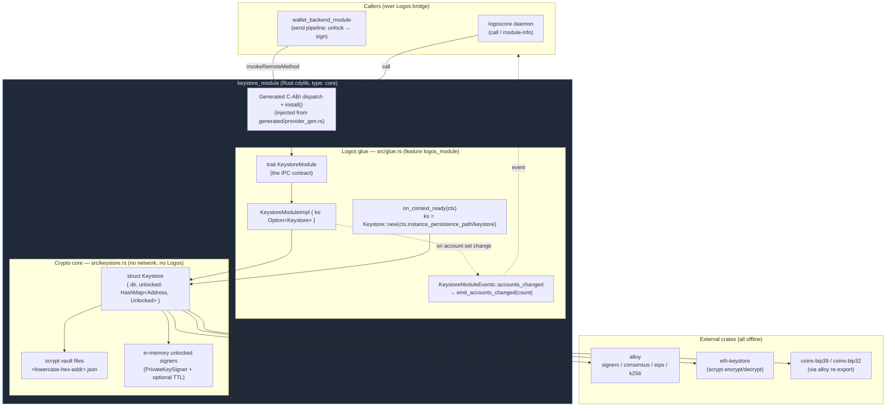

# `logos-evm-keystore-module` — Reference Specification

## Purpose

`logos-evm-keystore-module` is the **keystore** for the Logos multi-chain EVM
wallet. It is a Rust **cdylib Logos module** (`type: core`, `interface: cdylib`)
that owns everything to do with private keys: generating and importing them,
encrypting them at rest as scrypt vaults, holding them unlocked in memory for a
bounded time, and producing **secp256k1 signatures** — both EIP-191
`personal_sign` messages and signed EIP-1559 / legacy (EIP-155) transactions.

Its defining property is **isolation**: the module does **no networking**, and a
raw private key never crosses the module's IPC boundary. The only values that
leave the module are **addresses**, **signed payloads** (signature hex / raw
signed-transaction hex), and **(re-)encrypted keystore JSON**. The crypto core is
built on well-established crates — [`alloy`](https://github.com/alloy-rs/alloy)
(signing + transaction encoding), [`eth-keystore`](https://crates.io/crates/eth-keystore)
(Web3 Secure Storage scrypt vaults), and `coins-bip39` / `coins-bip32` (BIP-39 /
BIP-32 HD derivation, consumed through alloy's re-export).

### Where it sits in the EVM wallet system

The EVM wallet is built from seven repositories that talk to each other as
process-isolated Logos modules over a typed RPC bridge:

| Repo | Role | Talks to |
|------|------|----------|
| `logos-evm-net-proxy` | Fail-closed HTTP/RPC client **library crate** (not a module) | — |
| **`logos-evm-keystore-module`** | **Key management + signing (this repo)** | **nothing — leaf module** |
| `logos-evm-eth-rpc-module` | Multi-chain JSON-RPC transport (`concurrency: multi`) | net-proxy |
| `logos-evm-token-list-module` | Token-list fetch/merge per chain | net-proxy |
| `logos-evm-uniswap-module` | Uniswap V2/V3/V4 price oracle + swap building (`concurrency: multi`) | eth-rpc |
| `logos-evm-wallet-backend-module` | Coordinator + tx builder (alloy) | keystore, eth-rpc, token-list, uniswap |
| `logos-evm-wallet-ui` | Universal C++ `ui_qml` app | wallet-backend |

This module is a **leaf**: it declares **no dependencies** (`"dependencies": []`)
and calls no other module. It is driven *by* the `logos-evm-wallet-backend-module`
coordinator (which calls `unlock` then `sign_transaction` / `sign_message` as the
signing leg of its send pipeline) or directly by the headless `logoscore`
runtime. Keeping the keystore a dependency-free leaf is deliberate: the component
that holds private keys has the smallest possible attack surface and pulls in no
network-capable code.

---

## Overall architecture

The module is two layers that are deliberately decoupled by a Cargo feature:

* **The crypto core** (`rust-lib/src/keystore.rs`) — pure, offline, Logos-free
  Rust. The `Keystore` struct manages a directory of scrypt vault files plus the
  set of currently-unlocked in-memory signers. Unit-tested on its own with
  `cargo test --no-default-features`.
* **The Logos glue** (`rust-lib/src/glue.rs`) — the `KeystoreModule` contract
  trait and its implementation, compiled only behind the default `logos_module`
  feature. It marshals every structured value across the IPC boundary as a JSON
  string, wires the on-context-ready hook to a persistence path, and emits the
  `accounts_changed` event.



**Key isolation, restated against the diagram:** raw private-key bytes exist only
inside `Core` — encrypted in the vault files and decrypted briefly into the
in-memory `unlocked` map. They are never returned through `TRAIT` to a caller.
Only `Address` strings, signature/transaction hex, and re-encrypted keystore JSON
travel back across the `DISP` boundary.

---

## Communication with dependencies

This module is a **leaf** — it makes **no outbound calls** to any other module
and opens no sockets. The interesting flow is therefore how a **caller drives it**.
The canonical driver is `wallet_backend_module`, whose "send" pipeline uses the
keystore as its signing leg, and `logoscore` for ad-hoc/test calls.

```mermaid
sequenceDiagram
    autonumber
    participant BE as wallet_backend_module (caller)
    participant KS as keystore_module (this repo)
    participant DISK as scrypt vault dir<br/>(instance_persistence_path/keystore)
    participant MEM as in-memory unlocked map

    Note over KS: on_context_ready(ctx) →<br/>Keystore::new(ctx.instance_persistence_path/keystore)

    BE->>KS: import_private_key(priv_hex, password)
    KS->>DISK: encrypt_key (scrypt) → &lt;addr&gt;.json
    KS-->>BE: { ok:true, address }
    Note right of KS: emits accounts_changed(count)

    BE->>KS: unlock(address, password)
    KS->>DISK: decrypt_key(&lt;addr&gt;.json, password)
    KS->>MEM: insert PrivateKeySigner (no TTL)
    KS-->>BE: true

    BE->>KS: sign_transaction(address, unsigned_tx_json, chain_id)
    KS->>MEM: live_signer(address) (evict if TTL elapsed)
    Note right of KS: build TxEip1559 / TxLegacy,<br/>sign hash, EIP-2718 encode
    KS-->>BE: { ok:true, raw: "0x02…" }

    Note over BE: backend broadcasts raw tx via eth_rpc_module<br/>(keystore never touches the network)

    BE->>KS: lock(address)
    KS->>MEM: remove signer
    KS-->>BE: true
```

The signed `raw` transaction hex that `sign_transaction` returns is what the
backend then hands to `eth_rpc_module` for `eth_sendRawTransaction`. The keystore
itself never performs that broadcast — it has no network code at all.

---

## Full API reference

The contract is the `KeystoreModule` trait in `rust-lib/src/glue.rs`. The builder
derives the module's `.lidl` interface from this trait (`codegen.rust =
{ crate: "rust-lib", trait: "KeystoreModule", source: "src/glue.rs" }`); every
**non-defaulted** trait method becomes a callable module method. `on_context_ready`
is *defaulted*, so it is a framework hook and **not** part of the IPC contract.

### Conventions

* **Structured returns are JSON strings.** Methods that return `String` return a
  JSON object that is either `{ "ok": true, … }` on success or
  `{ "ok": false, "error": "<message>" }` on failure. The `err()` helper produces
  the error shape; the message text comes from `KeystoreError` (`Display`).
* **Boolean methods** (`has_address`, `delete_account`, `unlock`, `timed_unlock`,
  `lock`, `is_unlocked`) return a bare `bool` and are **fail-soft**: any internal
  error (bad address, wrong password, keystore not yet initialized) maps to
  `false` rather than an error object.
* **Addresses** are accepted with or without a `0x` prefix, in any case; no EIP-55
  checksum is required (`parse_address` decodes the 20 raw bytes directly). The
  `logoscore` CLI auto-types a `0x…` argument as a number, so in CLI examples
  addresses are passed as **bare hex**.
* **Numeric transaction fields** cross as hex (`0x…`) **or** decimal strings to
  avoid precision loss over JSON; empty/missing numeric fields default to `0`.
* **`logoscore call` argument typing:** `true`/`false` → bool, integers → int,
  else string; `@file` loads file contents as the argument.

### Method index

| Method | Params | Returns | Mutates accounts? |
|--------|--------|---------|-------------------|
| `create_mnemonic` | `words: i64` | `{ ok, phrase }` | no |
| `import_mnemonic` | `params_json: String` | `{ ok, address }` | yes → event |
| `new_account` | `password: String` | `{ ok, address }` | yes → event |
| `import_private_key` | `priv_hex: String, password: String` | `{ ok, address }` | yes → event |
| `import_keystore_json` | `key_json, password, new_password: String` | `{ ok, address }` | yes → event |
| `export_keystore_json` | `address, password: String` | `{ ok, keystore }` | no |
| `list_accounts` | — | `{ ok, accounts: [..] }` | no |
| `has_address` | `address: String` | `bool` | no |
| `delete_account` | `address, password: String` | `bool` | yes → event |
| `unlock` | `address, password: String` | `bool` | no |
| `timed_unlock` | `address, password: String, seconds: i64` | `bool` | no |
| `lock` | `address: String` | `bool` | no |
| `is_unlocked` | `address: String` | `bool` | no |
| `sign_transaction` | `address, unsigned_tx_json: String, chain_id: i64` | `{ ok, raw }` | no |
| `sign_message` | `address, message: String` | `{ ok, signature }` | no |

---

### `create_mnemonic(words: i64) -> String`

Generate a fresh BIP-39 English mnemonic. **Does not persist anything** — the
caller decides whether to import the phrase. The phrase is produced from
`rand::thread_rng()` and returned in cleartext (it is *not* a private key per se,
but it is seed material — treat it as a secret).

* **`words`** — word count. Must be one of `12 | 15 | 18 | 21 | 24`; any other
  value returns an error.

**Success:** `{ "ok": true, "phrase": "word1 word2 … wordN" }`
**Error:** `{ "ok": false, "error": "word count must be 12/15/18/21/24, got 13" }`

```bash
logoscore call keystore_module create_mnemonic 12
# → {"ok":true,"phrase":"… twelve words …"}
```

---

### `import_mnemonic(params_json: String) -> String`

Derive a single account from a mnemonic along the BIP-44 Ethereum path
`m/44'/60'/0'/0/<accountIndex>` and persist its scrypt vault. The argument is a
**JSON object** (`ImportMnemonicParams`):

| Field | Type | Required | Meaning |
|-------|------|----------|---------|
| `phrase` | string | yes | The BIP-39 mnemonic |
| `passphrase` | string | no (default `""`) | Optional BIP-39 passphrase (the "25th word"); applied only if non-empty |
| `accountIndex` (alias `account_index`) | u32 | no (default `0`) | HD index to derive |
| `password` | string | yes | Vault password used to scrypt-encrypt the derived key on disk |

Both `accountIndex` and `account_index` are accepted (serde alias). On success
emits `accounts_changed`.

**Success:** `{ "ok": true, "address": "0x…" }`
**Error:** `{ "ok": false, "error": "<parse / derivation error>" }`

```bash
logoscore call keystore_module import_mnemonic \
  @mnemonic.json   # {"phrase":"test test … junk","accountIndex":0,"password":"pw"}
# → {"ok":true,"address":"0xf39Fd6e51aad88F6F4ce6aB8827279cffFb92266"}
```

---

### `new_account(password: String) -> String`

Create a brand-new random account (`PrivateKeySigner::random()`) and persist its
scrypt vault under `password`. Emits `accounts_changed`.

* **`password`** — vault password.

**Success:** `{ "ok": true, "address": "0x…" }`
**Error:** `{ "ok": false, "error": "vault error: …" }` (e.g. I/O failure)

```bash
logoscore call keystore_module new_account hunter2
```

---

### `import_private_key(priv_hex: String, password: String) -> String`

Import a raw secp256k1 private key and persist its scrypt vault. The key is
consumed and immediately re-encrypted — it is not retained in cleartext beyond the
call, and it is never returned. Emits `accounts_changed`.

* **`priv_hex`** — 32-byte private key in hex, with or without a `0x` prefix.
* **`password`** — vault password.

**Success:** `{ "ok": true, "address": "0x…" }`
**Error:** `{ "ok": false, "error": "invalid private key: …" }`

```bash
logoscore call keystore_module import_private_key \
  ac0974bec39a17e36ba4a6b4d238ff944bacb478cbed5efcae784d7bf4f2ff80 pw
# → {"ok":true,"address":"0xf39Fd6e51aad88F6F4ce6aB8827279cffFb92266"}
```

---

### `import_keystore_json(key_json: String, password: String, new_password: String) -> String`

Import an existing scrypt **keystore JSON** (Web3 Secure Storage format),
decrypting it with `password` and **re-encrypting** it under `new_password` into a
fresh local vault. The decrypted key never leaves the module. Emits
`accounts_changed`.

* **`key_json`** — the source keystore JSON (a string; written to a short-lived
  temp file because `eth-keystore` is path-based, then decrypted).
* **`password`** — password that decrypts the *incoming* keystore JSON.
* **`new_password`** — password used to re-encrypt the vault stored locally.

**Success:** `{ "ok": true, "address": "0x…" }`
**Error:** `{ "ok": false, "error": "vault error: …" }` (wrong `password`, malformed JSON, etc.)

---

### `export_keystore_json(address: String, password: String) -> String`

Export an account as scrypt keystore JSON **without touching the on-disk vault**.
The password is **verified** (the vault is decrypted to prove the password is
correct) and then the canonical on-disk JSON contents are returned. The exported
JSON is itself scrypt-encrypted — it is *not* a cleartext key.

* **`address`** — account to export (with/without `0x`, any case).
* **`password`** — the vault password (must decrypt, else error).

**Success:** `{ "ok": true, "keystore": "<keystore JSON string>" }`
**Error:** `{ "ok": false, "error": "vault error: …" }` (wrong password or missing vault)

---

### `list_accounts() -> String`

List the addresses of all persisted vaults. Vaults are discovered by reading the
keystore directory and parsing each `<addr>.json` filename back into an address;
the list is sorted.

**Success:** `{ "ok": true, "accounts": ["0x…", "0x…"] }` (empty array if none)
**Error:** `{ "ok": false, "error": "keystore not initialized (context not ready)" }`

```bash
logoscore call keystore_module list_accounts
# → {"ok":true,"accounts":["0xf39Fd6e51aad88F6F4ce6aB8827279cffFb92266"]}
```

---

### `has_address(address: String) -> bool`

Return `true` iff a vault file exists for `address`. Fail-soft: an invalid address
or uninitialized keystore returns `false`.

* **`address`** — address to check.

```bash
logoscore call keystore_module has_address f39fd6e51aad88f6f4ce6ab8827279cfffb92266
# → true
```

---

### `delete_account(address: String, password: String) -> bool`

Permanently delete an account's vault. **Password-gated**: the vault is decrypted
with `password` first; only on success is the file removed and any unlocked signer
evicted. Emits `accounts_changed`. Returns `true` only when a vault existed, the
password was correct, and the file was removed; `false` otherwise (missing vault,
wrong password, parse error).

* **`address`** — account to delete.
* **`password`** — its vault password (required to authorize deletion).

```bash
logoscore call keystore_module delete_account <address> pw
# → true
```

---

### `unlock(address: String, password: String) -> bool`

Decrypt the account's vault with `password` and hold the resulting
`PrivateKeySigner` in memory **with no expiry**, enabling subsequent signing.
Returns `true` on success, `false` on any failure (missing vault, wrong password,
invalid key). The decrypted key lives only in the in-memory `unlocked` map.

* **`address`** — account to unlock.
* **`password`** — its vault password.

```bash
logoscore call keystore_module unlock f39fd6e51aad88f6f4ce6ab8827279cfffb92266 pw
# → true
```

---

### `timed_unlock(address: String, password: String, seconds: i64) -> bool`

Like `unlock`, but the in-memory signer carries a **TTL** of `seconds`. After the
deadline elapses the signer is **lazily evicted** the next time it is accessed
(`live_signer` checks `Instant::now() >= expires_at` on every signing/`is_unlocked`
call and removes the entry). Negative `seconds` is clamped to `0` (immediate
expiry). Returns `true` on successful decrypt+insert.

* **`address`** — account to unlock.
* **`password`** — its vault password.
* **`seconds`** — auto-relock TTL in seconds (`>= 0`).

```bash
logoscore call keystore_module timed_unlock <address> pw 300
# → true   (auto-relocks ~5 min later, on next access)
```

---

### `lock(address: String) -> bool`

Remove the in-memory signer for `address`, re-locking it. Returns `true` if a
signer was present and removed, `false` if it was already locked or the address is
invalid. The on-disk vault is untouched.

```bash
logoscore call keystore_module lock <address>
# → true
```

---

### `is_unlocked(address: String) -> bool`

Return `true` iff `address` currently has a live (non-expired) in-memory signer.
This call **also evicts** an expired timed-unlock signer as a side effect (it goes
through `live_signer`). Invalid address → `false`.

```bash
logoscore call keystore_module is_unlocked <address>
# → true | false
```

---

### `sign_transaction(address: String, unsigned_tx_json: String, chain_id: i64) -> String`

Sign an unsigned transaction and return the **raw, broadcast-ready** signed
transaction as an EIP-2718-encoded hex envelope. The account **must be unlocked**
(via `unlock`/`timed_unlock`), otherwise the call errors with `account is locked`.

* **`address`** — signing account (must be unlocked).
* **`unsigned_tx_json`** — JSON object describing the unsigned tx (see
  [Unsigned-transaction JSON](#unsigned-transaction-json-unsignedtx)).
* **`chain_id`** — chain id for replay protection (EIP-155 for legacy, the
  `chainId` field for EIP-1559).

The `fee_mode` field selects the envelope type:

* `"eip1559"` (default / anything that isn't `"legacy"`) → `TxEip1559`, returns a
  typed `0x02…` envelope. Uses `max_fee_per_gas` / `max_priority_fee_per_gas`;
  `access_list` is empty.
* `"legacy"` (case-insensitive) → `TxLegacy` with EIP-155 `chain_id`, returns an
  RLP legacy envelope. Uses `gas_price`.

**Success:** `{ "ok": true, "raw": "0x02…" }` (EIP-1559) or `{ "ok": true, "raw": "0x…" }` (legacy)
**Error:** `{ "ok": false, "error": "account is locked: …" }` or
`{ "ok": false, "error": "invalid parameters: tx json: …" }`

```bash
logoscore call keystore_module sign_transaction <address> @tx.json 1
# → {"ok":true,"raw":"0x02f86c01808459682f00…"}
```

---

### `sign_message(address: String, message: String) -> String`

Produce an **EIP-191 `personal_sign`** signature over the UTF-8 bytes of
`message`. The account **must be unlocked**. Returns a 65-byte signature as
`0x…` hex (`r ‖ s ‖ v`).

* **`address`** — signing account (must be unlocked).
* **`message`** — the message to sign (signed as raw bytes via
  `sign_message_sync`, which applies the standard `"\x19Ethereum Signed Message:\n"`
  prefix).

**Success:** `{ "ok": true, "signature": "0x…(130 hex chars)…" }`
**Error:** `{ "ok": false, "error": "account is locked: …" }`

```bash
logoscore call keystore_module sign_message <address> hello-logos
# → {"ok":true,"signature":"0x…"}
```

---

### Events

The module declares a typed event contract:

```rust
pub trait KeystoreModuleEvents {
    fn accounts_changed(&self, count: i64);
}
```

`accounts_changed(count)` is emitted (via the generated `emit_accounts_changed`)
**whenever the set of persisted accounts changes** — after a successful
`import_mnemonic`, `new_account`, `import_private_key`, `import_keystore_json`, or
`delete_account`. `count` is the new total number of vaults
(`Keystore::list_accounts().len()`). Subscribers (e.g. the wallet UI/backend) can
use it to refresh their account list without polling. All event params are
std-typed (`i64`).

---

## Configuration & data model

### Module manifest (`metadata.json`)

| Field | Value | Notes |
|-------|-------|-------|
| `name` | `keystore_module` | Module id used by `logoscore`/`lgpm` |
| `version` | `1.0.0` | |
| `type` | `core` | Core (non-UI) module |
| `interface` | `cdylib` | Rust-first cdylib module |
| `category` | `wallet` | |
| `main` | `keystore_module_plugin` | Plugin entry name |
| `dependencies` | `[]` | **Leaf** — no module deps |
| `capabilities` | `[]` | Declares no capability requirements |
| `codegen.rust` | `{ crate: "rust-lib", trait: "KeystoreModule", source: "src/glue.rs" }` | The contract source for the builder's code generator |
| `nix` | empty `external_libraries` / `packages` / `cmake` | No external system libs — the crypto is pure-Rust crates |

There is **no `concurrency` field**, so the keystore runs in the **default
(single-handler) dispatch mode** — calls are processed one at a time. (Contrast
with `eth_rpc_module` / `uniswap_module`, which set `concurrency: "multi"`.) See
[Concurrency](#concurrency).

### Persistence location & on-context-ready

On `on_context_ready(ctx)` the glue computes the keystore directory as
`ctx.instance_persistence_path / "keystore"` and constructs `Keystore::new(dir)`.
Until that hook runs, `self.ks` is `None` and `String`-returning methods report
`keystore not initialized (context not ready)` while bool methods return `false`.
The `instance_persistence_path` is supplied by the Logos runtime
(`RustModuleContext`), so each module instance gets its own isolated vault
directory.

### On-disk vault files

* **One file per account**, named `<lowercase-hex-address>.json` (no `0x`
  prefix), e.g. `f39fd6e51aad88f6f4ce6ab8827279cfffb92266.json`.
* Each file is a **scrypt-encrypted keystore JSON** (Web3 Secure Storage format)
  produced by `eth-keystore::encrypt_key`. The 32-byte secp256k1 private key is
  the encrypted payload; the password is the scrypt secret.
* `list_accounts` works purely by listing the directory and parsing filenames; no
  vault is decrypted to enumerate accounts.

### In-memory state

```rust
struct Unlocked { signer: PrivateKeySigner, expires_at: Option<Instant> }

pub struct Keystore {
    dir: PathBuf,
    unlocked: HashMap<Address, Unlocked>,   // only while unlocked
}
```

A decrypted key exists **only** inside an `Unlocked.signer` and only between
`unlock`/`timed_unlock` and `lock` (or TTL eviction). `expires_at = None` means
"until explicitly locked"; `Some(instant)` is the timed-unlock deadline, checked
lazily by `live_signer`.

### Unsigned-transaction JSON (`UnsignedTx`)

The `unsigned_tx_json` argument to `sign_transaction` deserializes into:

| Field | Type | Default | Meaning |
|-------|------|---------|---------|
| `to` | string? | `null`/empty → contract `Create` | recipient address; empty/absent ⇒ contract creation (`TxKind::Create`) |
| `value` | string | `"0"` | wei value (hex `0x…` or decimal), parsed as `U256` |
| `nonce` | string | (required field) | account nonce (hex/decimal `u64`) |
| `gas_limit` | string | `"0"` | gas limit (`u64`) |
| `data` | string | `""` | calldata hex (`0x…`), parsed to `Bytes` |
| `fee_mode` | string | `""` → EIP-1559 | `"eip1559"` (default) or `"legacy"` (case-insensitive) |
| `max_fee_per_gas` | string | `"0"` | EIP-1559 only (`u128`) |
| `max_priority_fee_per_gas` | string | `"0"` | EIP-1559 only (`u128`) |
| `gas_price` | string | `"0"` | legacy only (`u128`) |

Numeric parsing accepts `0x`/`0X` hex or plain decimal; empty strings parse to `0`
/ `U256::ZERO`.

Example (EIP-1559, the one used by the doc-test's `tx.json`):

```json
{
  "to": "0x70997970C51812dc3A010C7d01b50e0d17dc79C8",
  "value": "0xde0b6b3a7640000",
  "nonce": "0x0",
  "gas_limit": "0x5208",
  "max_fee_per_gas": "0x77359400",
  "max_priority_fee_per_gas": "0x3b9aca00",
  "fee_mode": "eip1559"
}
```

---

## Build, run & test

### Build

```bash
# Crypto core only — no Logos runtime, no generated scaffold needed.
cd rust-lib && cargo test --no-default-features

# Full module (Qt plugin) + installable .lgx package, via nix.
nix build .#install   # → result/modules/keystore_module/
nix build .#lgx       # → result/*.lgx
```

The `flake.nix` is ~15 lines: it delegates to
`logos-module-builder.lib.mkLogosModule { src; configFile = ./metadata.json; … }`,
which reads `metadata.json`, runs the Rust code generator on the `KeystoreModule`
trait, injects the generated scaffold at the `include!(.../generated/provider_gen.rs)`
point in `glue.rs`, and compiles the `staticlib` into the Qt plugin. `CMakeLists.txt`
is the thin bridge (`logos_module(NAME keystore_module)` via `LogosModule.cmake`).

The crate is `crate-type = ["staticlib", "rlib"]` with `resolver = "3"` and
`rust-version = "1.89"` so the MSRV-aware resolver picks dependency versions that
compile under the builder's `rustc 1.89`. The Logos SDK
(`logos-rust-sdk`) is an **optional** dependency enabled by the default
`logos_module` feature, so `cargo test --no-default-features` builds the crypto
core in isolation without the SDK or generated scaffold.

### Run / drive via `logoscore`

The module is loaded into a headless `logoscore` daemon and called over IPC.
End-to-end, as the doc-test does it:

```bash
# 1. Build logoscore + lgpm from their flakes
nix build 'github:logos-co/logos-logoscore-cli#cli' --out-link ./logos
nix build 'github:logos-co/logos-package-manager#cli' -o lgpm

# 2. Build this module's .lgx, seed the capability module, install
nix build '.#lgx' -o keystore-lgx
mkdir -p modules && cp -RL ./logos/modules/. ./modules/   # bundled capability_module
./lgpm/bin/lgpm --modules-dir ./modules --allow-unsigned install --file keystore-lgx/*.lgx

# 3. Start the daemon, load, and drive
logoscore -D -m ./modules > logs.txt &
sleep 3
logoscore load-module keystore_module
logoscore module-info keystore_module        # lists sign_transaction, sign_message, …
logoscore call keystore_module create_mnemonic 12
logoscore call keystore_module import_private_key <privkey> pw   # → {address}
logoscore call keystore_module list_accounts
logoscore call keystore_module unlock <address> pw
logoscore call keystore_module sign_message <address> hello-logos
logoscore call keystore_module sign_transaction <address> @tx.json 1
logoscore stop
```

The bundled `capability_module` (shipped with `logoscore`) handles the load-time
auth handshake, which is why it is seeded into `./modules` before installing this
module.

### How the doc-test exercises it

`doctests/keystore-module-runtime.test.yaml` (rendered to
`doctests/outputs/keystore-module-runtime.md`, run by `doctests/run.sh` and CI in
`.github/workflows/doctests.yml` on `ubuntu-latest` + `macos-latest`) runs the
flow above end-to-end. It is **fully offline and deterministic**: it uses
Foundry's canonical test mnemonic / account 0
(`0xf39Fd6e51aad88F6F4ce6aB8827279cffFb92266`, private key
`ac0974…ff80`) and asserts:

* `create_mnemonic 12` output contains `phrase`;
* `import_private_key` returns the expected address (`f39Fd6e51aad…`), proving the
  key stayed inside while only the address came out;
* `unlock` returns `true`; `sign_message` returns a `0x…` `signature`;
* `sign_transaction … @tx.json 1` returns a `raw` value starting with `0x02`
  (a typed EIP-1559 envelope).

The CI workflow resolves the commit under test and passes
`--release-for logos-evm-keystore-module=<sha>` so the spec's `{release}`
placeholder builds the PR's own code, then publishes a two-column HTML report to
GitHub Pages.

### Unit tests (crypto core)

`rust-lib/src/keystore.rs` carries `#[cfg(test)]` tests runnable with
`cargo test --no-default-features`, covering:

* `hd_derivation_matches_known_vector` — BIP-44 derivation of accounts 0/1 from
  the Foundry mnemonic matches known addresses.
* `private_key_import_matches_address` — imported PK yields the expected address.
* `create_mnemonic_lengths` — 12/24 words succeed, 13 fails.
* `vault_roundtrip_and_listing` — import → `has_address`/`list_accounts`; wrong
  password fails to unlock, correct password unlocks, then `lock` re-locks.
* `sign_message_recovers_signer` — EIP-191 signature recovers to the signer.
* `locked_account_cannot_sign` — signing a locked account yields
  `KeystoreError::Locked`.
* `sign_eip1559_recovers_signer` / `sign_legacy_recovers_signer` — decode the
  raw signed tx (EIP-2718) and recover the original signer; the EIP-1559 envelope
  starts with `0x02`.

---

## Security model & invariants

This module is the wallet's **secret-holding boundary**. Its security properties:

1. **Private keys never cross the IPC boundary.** No method takes or returns a raw
   private key *out* of the module. The only inbound key material is
   `import_private_key`'s `priv_hex` and `import_keystore_json`'s decrypt path;
   both are immediately re-encrypted into a vault and never echoed back. Outbound
   values are limited to addresses, signature/transaction hex, and re-encrypted
   keystore JSON. This is asserted by the doc-test (import returns only the
   address) and by the `keystore.rs` doc comments.

2. **No network.** The crate pulls in **narrow alloy features only** (`consensus`,
   `eips`, `rlp`, `signers`, `signer-local`, `signer-mnemonic`, `k256`) — no
   `provider`/`rpc`/`network`. There is no HTTP client, no socket, no net-proxy.
   The module cannot exfiltrate a key over the wire because it has no wire.
   (Network access in the wallet is concentrated in `eth_rpc`/`token_list`, which
   are fail-closed through `logos-evm-net-proxy`; the keystore deliberately stays
   out of that path.)

3. **At rest: scrypt vaults.** Keys live on disk only as `eth-keystore`
   scrypt-encrypted JSON, one file per account, in the module's isolated
   `instance_persistence_path`.

4. **In memory: bounded by unlock.** A decrypted key exists in RAM only inside an
   `Unlocked.signer`, only between `unlock`/`timed_unlock` and `lock`/TTL
   eviction. Signing requires a live signer — a locked account returns
   `account is locked`. `timed_unlock` provides automatic re-locking
   (lazily enforced on next access).

5. **Password-gated destructive ops.** `delete_account` and `export_keystore_json`
   both require the correct vault password (they decrypt to verify) before acting,
   so neither can be abused by a caller that doesn't already hold the password.

6. **Replay protection.** `sign_transaction` always binds the `chain_id`
   (EIP-155 for legacy, the `chainId` field for EIP-1559), so a signed tx cannot
   be replayed on another chain.

---

## Concurrency

The keystore declares **no `concurrency` field** in `metadata.json`, so it runs in
the framework's **default single-handler dispatch**: the runtime processes one
call at a time. This is appropriate here because the operations mutate shared
state (`Keystore.unlocked` map, vault files) and are fast (local scrypt + signing,
no network latency), so there is no benefit to concurrent dispatch and serial
execution avoids data races on the unlocked-signer map without extra locking.

This contrasts with the wallet's `concurrency: "multi"` modules
(`eth_rpc_module`, `uniswap_module`), which fan out network-bound RPC calls
concurrently and resolve them via a pending-sentinel. The keystore has no
network-bound work to overlap, so it stays single — the simplest model for the
component that must be the most careful with shared secret state.
